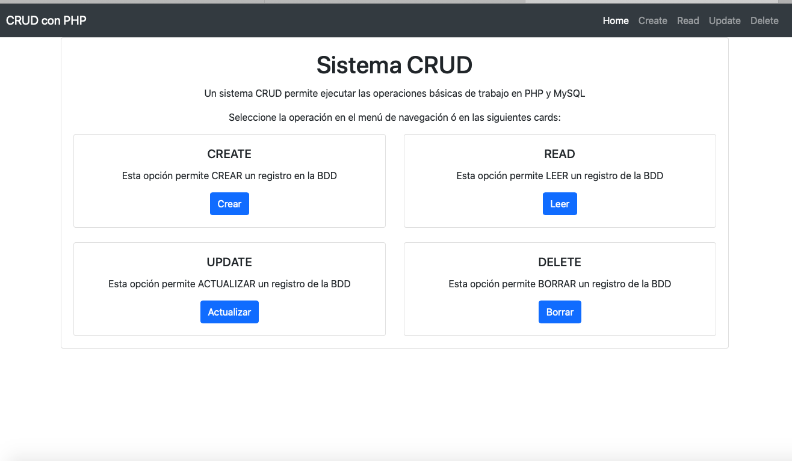

# crudPhpMysql
<<<<<<< HEAD
Sistema CRUD educacional para entender el funcionamiento las operaciones básicas (Create Read Update Delete). Está desarrollado en lenguaje PHP, usando estilos CSS importados de clases bootstrap y motor de base de datos MySQL
=======
Sistema CRUD educacional para entender el funcionamiento las operaciones básicas (Create Read Update Delete). Está desarrollado en lenguaje PHP, usando estilos CSS importados de bootstrap y motor de base de datos MySQL.

>>>>>>> 49fe2d963a1af98d2d56f8021955b8dae9036698
